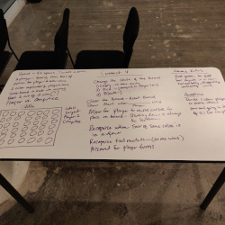
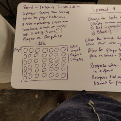
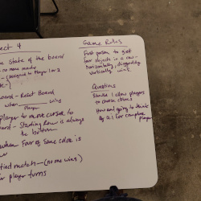

# Connect-Four

#### A full-stack web application built as first project.

## Description
Connect Four: a two player connection game. First player to get four of the same colored checkers in a row either horizontally, vertically or diagonally wins.

## Table of Contents
* [Technologies Used](#technologiesused)
* [Features](#features)
* [Design](#design)
* [Project Next Steps](#nextsteps)
* [Deployed App](#deployment)
* [About the Author](#author)

## Technologies Used
* JavaScript
* HTML5
* CSS3
* jQuery

## Features
Users can play a round of classic game Connect Four.
Users can take turn playing game pieces.
Users can reset the game and choose to have music on or off.

Wireframe:

Whiteboard:

## Design
* Design elements implemented using HTML5 and CSS3. 

## Project Next Steps
* Allow the user to chose player one or player two.
* Allow users to play against computer.
* Add a timekeeper.
* Add a placeholder to show player turns.
* Add a scoreboard. 

## Deployed Link
[Github.io](https://tangelia.github.io/Connect-Four/)

* You can view the repository:
[Github.com](https://github.com/tangelia/Connect-Four)
    

## About the Author

Tangelia is a Southerner and an avid tea drinker based in Atlanta. Prior to General Assembly and Codebridge, she held pivotal roles in finance and traditional print media, where she worked with C-Level executives for over 15 years in corporate America on advertising and marketing campaigns. After leaving corporate America, Tangelia discovered her passion for designing tools that make processes more efficient. She realized that software engineering would be the perfect opportunity to combine this passion with her love for problem solving. Tangelia's love for learning and making an impact runs strong,and she is excited to contribute her creativity to a full-stack software development role. Learn more about Tangelia [here](https://www.linkedin.com/in/tangeliabroom). 

